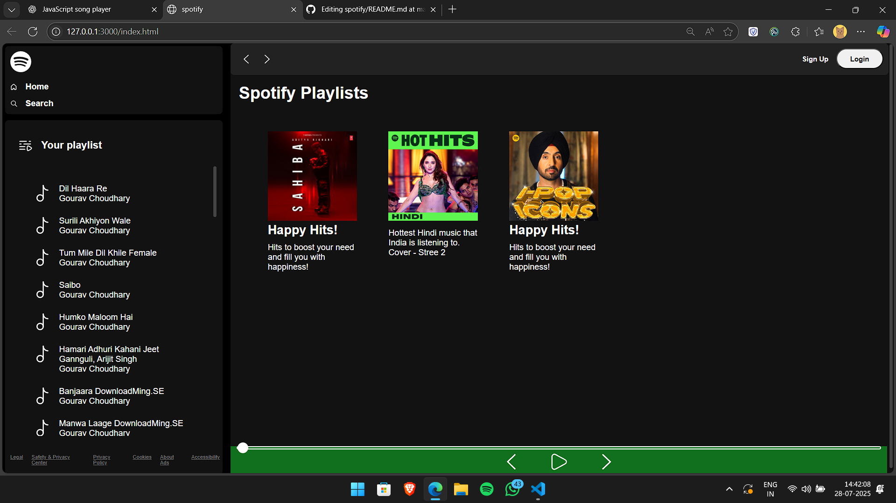

# 🎵 Spotify Clone Web App

This is a **Spotify-inspired music player web application** built using HTML, CSS, and JavaScript. It dynamically fetches `.mp3` files from a local server and displays a list of songs for the user to play, with a sleek UI resembling Spotify's desktop layout.

## 📸 Preview

 <!-- optional -->

---

## 🚀 Features

- 📁 Dynamic playlist loading from local backend
- ▶️ Play songs directly in browser
- 🎧 Scrollable song list with hover effects
- 🖼️ Custom card layout for recommended playlists
- 🎨 Responsive and Spotify-like UI
- 🔊 Playbar with controls and seekbar (under development)

---

## 🧰 Technologies Used

- **HTML5**
- **CSS3**
- **JavaScript (Vanilla)**
- Fetch API (for loading songs dynamically)
- Local Express.js server (assumed for song serving)

---

## 📂 Folder Structure

